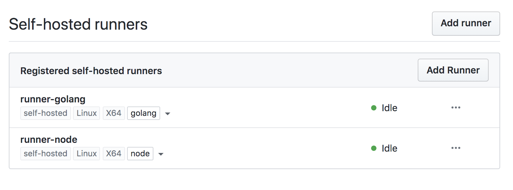

# 👌 Github Actions self-hosted runner provisionning

> Simple Docker images for starting self-hosted Github Actions runner(s).



[Github official documentation for self-hosted runners.](https://help.github.com/en/actions/hosting-your-own-runners/adding-self-hosted-runners)

## 🚀 Quick start

Add your self-hosted runner from your repository settings:

- Go to repository > settings > actions
- Click on "Add runner"
- Copy the URL and token

```sh
# start a runner on your server

$ docker run -d \
    -v /var/run/docker.sock:/var/run/docker.sock \
    -v /tmp:/tmp \
    -e GH_RUNNER_TOKEN=xxxxxxxxxxxxx \
    -e GH_REPOSITORY=xxxxxxxxxxxx \
    samber/github-actions-runner:latest
```

```yaml
# .github/workflows/main.yml

on:
  - push

jobs:
  example:
    runs-on: self-hosted
    steps:
      - name: Hello world
        run: echo "Hello world"
```

### Runners with language support (NodeJS, Python3...)

Just select your runner in the Docker image tag.

Currently available:

- samber/github-actions-runner:**node**
- samber/github-actions-runner:**golang**
- samber/github-actions-runner:**python**
- samber/github-actions-runner:**java**
- samber/github-actions-runner:**php**

```sh
# start a NodeJS runner

$ docker run -d \
    -v /var/run/docker.sock:/var/run/docker.sock \
    -v /tmp:/tmp \
    -e GH_RUNNER_TOKEN=xxxxxxxxxxxxx \
    -e GH_REPOSITORY=xxxxxxxxxxxx \
    samber/github-actions-runner:node
```

```yaml
# .github/workflows/main.yml

on:
  - push

jobs:
  frontend:
    runs-on: self-hosted
    steps:
      - uses: actions/checkout@v2
      - name: Fetch dependencies
        run: yarn
      - name: Build application
        run: npm run build
      - name: Execute tests
        run: npm run test
```

### Missing language support ?

You just need to write a Dockerfile starting with `FROM samber/github-actions-runner:latest`.

You can contribute to this repository or create your own Docker image.

## 💡 Docker compose

### Simple runner

```yaml
version: '3'

services:

  runner:
    image: samber/github-actions-runner:latest
    volumes:
      - /var/run/docker.sock:/var/run/docker.sock
      - /tmp:/tmp
    environment:
      - GH_RUNNER_TOKEN=xxxxxxxxxxxxx
      - GH_REPOSITORY=xxxxxxxxxxxx
    restart: unless-stopped
```

```sh
$ docker-compose up -d
```

### Concurrent executors

```sh
$ docker-compose scale runner=3
```

### Runners with language support

You will need to register multiple runners, with different name+tokens.

In the following example, we created 2 self-hosted runners: node and golang, with respective runner tag: "node" and "golang".

```yaml
version: '3'

services:

  runner-node:
    image: samber/github-actions-runner:node
    volumes:
      - /var/run/docker.sock:/var/run/docker.sock
      - /tmp:/tmp
    environment:
      - GH_RUNNER_TOKEN=xxxxxxxxxxxxx
      - GH_REPOSITORY=yyyyyyyyyyyyy
    restart: unless-stopped

  runner-golang:
    image: samber/github-actions-runner:golang
    volumes:
      - /var/run/docker.sock:/var/run/docker.sock
      - /tmp:/tmp
    environment:
      - GH_RUNNER_TOKEN=zzzzzzzzzzzzz
      - GH_REPOSITORY=yyyyyyyyyyyyy
    restart: unless-stopped
```

```sh
$ docker-compose up -d
$ docker-compose scale runner-node=2 runner-golang=2
```

After starting containers, add tags to runners (such as `golang` and `node`) from the repository settings.

```yaml
# .github/workflows/main.yml

on:
  - push

jobs:

  frontend:
    runs-on: [self-hosted, node]
    steps:
      - uses: actions/checkout@v2
      - name: Fetch dependencies
        run: yarn
      - name: Build application
        run: npm run build
      - name: Execute tests
        run: npm run test

  api:
    runs-on: [self-hosted, golang]
    steps:
      - uses: actions/checkout@v2
      - name: Fetch dependencies
        run: go mod download
      - name: Build application
        run: go build -o hello-world
      - name: Execute tests
        run: go testt
```

## 🤯 Advanced

### Run as root

For whatever (bad 😅) reason, if you need to start runners as root, you have to set container user to `root`, and add an empty `RUNNER_ALLOW_RUNASROOT` environment variables.

## 🔬 Build

```bash
docker build -f Dockerfile          -t samber/github-actions-runner:latest  -t samber/github-actions-runner:2.169.1 .
docker build -f Dockerfile.node     -t samber/github-actions-runner:node    -t samber/github-actions-runner:node-2.169.1 .
docker build -f Dockerfile.golang   -t samber/github-actions-runner:golang  -t samber/github-actions-runner:golang-2.169.1 .
docker build -f Dockerfile.python   -t samber/github-actions-runner:python  -t samber/github-actions-runner:python-2.169.1 .
docker build -f Dockerfile.java     -t samber/github-actions-runner:java    -t samber/github-actions-runner:java-2.169.1 .
docker build -f Dockerfile.php      -t samber/github-actions-runner:php     -t samber/github-actions-runner:php-2.169.1 .

docker push samber/github-actions-runner:latest
docker push samber/github-actions-runner:2.169.1

docker push samber/github-actions-runner:node
docker push samber/github-actions-runner:node-2.169.1

docker push samber/github-actions-runner:golang
docker push samber/github-actions-runner:golang-2.169.1

docker push samber/github-actions-runner:python
docker push samber/github-actions-runner:python-2.169.1

docker push samber/github-actions-runner:java
docker push samber/github-actions-runner:java-2.169.1

docker push samber/github-actions-runner:php
docker push samber/github-actions-runner:php-2.169.1
```

## ♻️  Host cleanup

Clean stopped containers on a daily basis:

```sh
$ crontab -e

0 0 * * * /usr/bin/docker system prune -f
```

## 🤝 Contributing

This project is open source and contributions from community (you!) are welcome.

There are many ways to contribute: writing code, documentation, reporting issues...

## Author

👤 **Samuel Berthe**

* Twitter: [@samuelberthe](https://twitter.com/samuelberthe)
* Github: [@samber](https://github.com/samber)

## 💫 Show your support

Give a ⭐️ if this project helped you!

[](https://www.patreon.com/samber)

## 📝 License

Copyright © 2020 [Samuel Berthe](https://github.com/samber).

This project is [MIT](./LICENSE) licensed.
